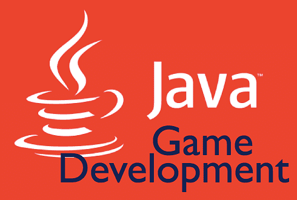

# Описание проекта
В этом проекте вам предлагается реализовать одну из трех игр: Змейка, Три в ряд или Шахматы. Вы можете выбрать любую из этих игр для разработки. Каждая игра имеет свои уникальные механики и требования, которые помогут вам улучшить навыки программирования и работы с графическим интерфейсом.

## Выбор игры
### Змейка (easy)
   Описание: Игрок управляет змейкой, которая движется по игровому полю, собирая еду и увеличивая свою длину. Игра заканчивается, если змейка сталкивается с границей поля или с самой собой.
   Требования:
   - Игровое поле размером 20x20 клеток.
   - Управление змейкой с помощью стрелок на клавиатуре.
   - Генерация еды в случайных местах.
   - Отображение счета (количество съеденной еды).
   - Возможность перезапуска игры после окончания.
### Три в ряд (mid)
   Описание: Игрок должен составить ряд из трех или более одинаковых элементов, чтобы они исчезли. Игра продолжается до тех пор, пока есть возможные ходы.
   Требования:
   - Проверка на наличие рядов из трех и более одинаковых элементов.
   - Игровое поле размером 8x8 клеток с различными элементами (например, цветные шарики).
   - Удаление найденных рядов и заполнение пустых мест новыми элементами.
   - Отображение счета за каждое удаление.
   - Возможность обмена местами соседних элементов.
### Шахматы (hard) 
   Описание: Классическая игра в шахматы, где два игрока по очереди делают ходы. Игра заканчивается, когда один из игроков ставит мат противнику.
   Требования:
   - Игровое поле 8x8 с фигурами, представленными графически.
   - Возможность перемещения фигур в соответствии с правилами шахмат.
   - Проверка на шах и мат.
   - Отображение игрового курсора (какая фигура сейчас выбрана)
   - Отображение цвета игрока, чья очередь сейчас ходить

## Общие технические требования:
   - Язык программирования: Java
   - Графический интерфейс: Используйте библиотеку Swing для создания графического интерфейса.
   - Структура проекта: Разделите код на классы для логики игры, графического интерфейса и управления событиями.
### Установка и запуск:
1. Убедитесь, что у вас установлен JDK (Java Development Kit).
2. Заведите аккаут на github, если у вас это ещё не сделано.
3. Fork-ните проект к себе 
4. Откройте проект в вашей IDE (например, IntelliJ IDEA). 
5. Скомпилируйте и запустите основной класс игры (Main). 
6. Заметьте, что в проекте уже реализовано игровое поле 20x20 и "прослушиватель" нажатых клавиш.

### Дополнительные рекомендации
- Протестируйте игру на наличие ошибок и багов.
- Добавьте комментарии к коду для улучшения его читаемости.
- Перепишите README.md к своей игре
   

### Контакты
Если у вас есть вопросы или вам нужна помощь, не стесняйтесь обращаться к преподавателю или ассистенту).

## Дорогу осилит идущий!